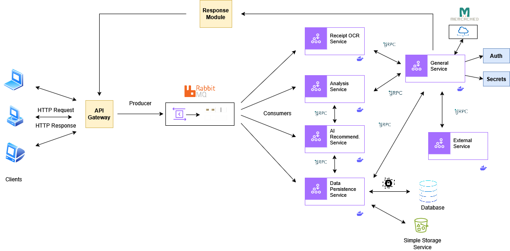

# ExpenAI

ExpenAI is a full-stack expense tracker that helps users log and visualize their purchases. You can either enter item details manually or upload a receipt and let AI extract the information automatically.

## Architecture



## Features

- Login/signup functionality
- Add expenses manually or through receipt upload
- Auto-extraction of receipt info using Mindee’s OCR API
- Store uploaded receipt images on Google Cloud Storage
- View all previous receipts and items
- Dashboard with summaries and visualizations
- Responsive frontend and clean UI
- Dockerized setup for deployment
- Terraform support for provisioning VM on Google Cloud

## Tech Stack

- **Frontend:** React, Axios, CSS
- **Backend:** Node.js, Express, MongoDB, Mongoose
- **AI Parsing:** Mindee Receipt OCR API
- **Cloud Integration:** Google Cloud Storage (GCS)
- **Infrastructure:** Docker, Terraform

## How it Works
- User logs in or signs up.
- They can add expense manually or upload a receipt.
- Uploaded receipt is parsed using Mindee API to fill form fields.
- On submit, data is saved to MongoDB, and if a file is uploaded, it's saved to GCS.
- Dashboard shows summaries, recent charts, and access to all receipt history.
- Clicking on a receipt shows detailed breakdown with image and totals.

## Local Development

### 1. Clone the repository:

```bash
git clone https://github.com/your-username/expenai.git
cd expenai
```

### 2. Install dependencies and set up environment:

```bash
cd client
npm install
npm run build     # For production

cd ..
npm install
```

### 3. Create a .env file in the root:
```ini
MONGO_URI=your_mongo_connection
JWT_SECRET=your_jwt_secret
MINDEE_API_KEY=your_mindee_key
GCS_BUCKET=your_bucket_name
GCS_KEY_PATH=./secrets/gcs_key.json
```

### 4. Start the app (locally)
```bash
node app.js
```

## Docker Usage

### To run both client and server using Docker:

```bash
docker-compose up --build
```

### Production Docker Build (for deployment):
```bash
docker build -t expenai-server .
```

### Transfer the image to your GCP VM using docker save or scp, then run:
```bash
docker run -d \
  --name expenai-server \
  -p 3001:3001 \
  --env-file .env \
  -v $(pwd)/secrets/gcs_key.json:/app/secrets/gcs_key.json \
  expenai-server
```

## Deployment
1. Use Terraform to provision a GCP VM
2. SSH into the VM and clone this repo
3. Add .env and secrets manually on the server
4. Use docker run to start the container

## Notes
1. In-memory caching is used on the dashboard route for performance
2. `.env` and secrets/ are excluded from GitHub
3. Clean UI design, mobile-responsive
4. All routes protected with cookie-based JWT auth